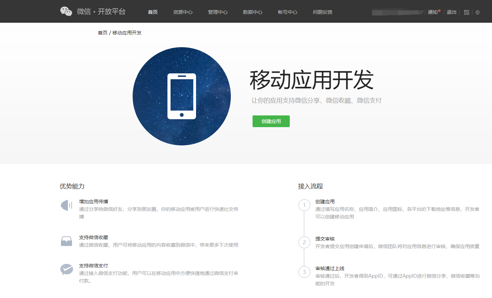
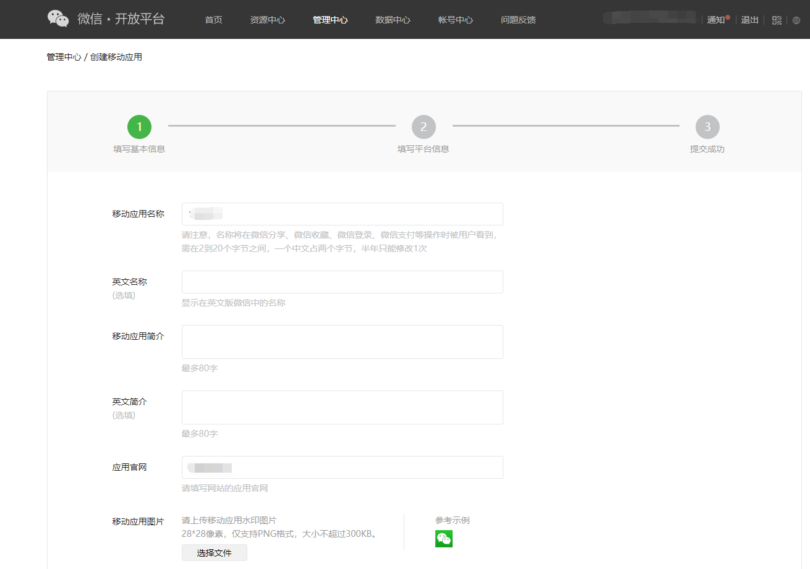
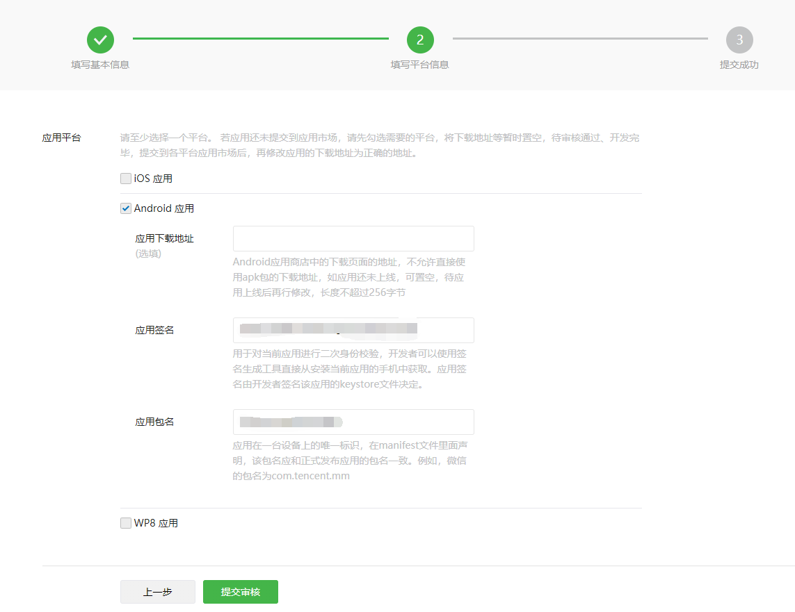
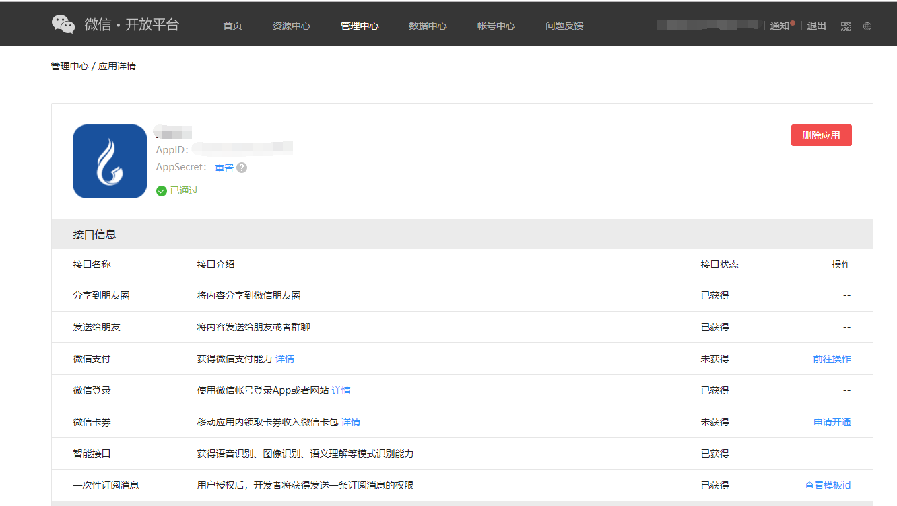

## HBuider 实现微信登录

## 所需条件

> 1. 在微信开放平台进行申请移动应用
> 2. HBuilderX中配置登录授权
> 3. 代码用例

首先登录微信开放平台 https://open.weixin.qq.com/，选择移动应用开发，创建应用，如下图所示：



填写所需的基本应用信息，再填写平台信息，如下图所示：





在管理中心可以查看审核通过的应用的信息以及权限，可以看到微信登录是已经使用了，如下图所示：



接着我们在HubilderX中配置登录授权，这里直接参考官方文档配置的说明,其中appid，appSecret指的是微信开放平台审核通过的应用的appid，appSecre

> https://ask.dcloud.net.cn/article/192

最后，就是我们微信登录代码用例了，如下图所示：

```javascript
 weixinLogin() {
      var _this = this
      var weixinService = null
      mui.plusReady(function() {
         // 参考：http://www.html5plus.org/doc/zh_cn/oauth.html#plus.oauth.getServices
        plus.oauth.getServices(
          function(services) {
            if (services && services.length) {
              for (var i = 0, len = services.length; i < len; i++) {
                if (services[i].id === 'weixin') {
                  weixinService = services[i]
                  break
                }
              }
              if (!weixinService) {
                console.log('没有微信登录授权服务')
                return
              }
               //参考： http://www.html5plus.org/doc/zh_cn/oauth.html#plus.oauth.AuthService.authorize
              weixinService.authorize(
                function(event) {
                  _this.weixinCode = event.code // 用户换取 access_token 的 code
                   // 请求服务端授权登录
          		  // 服务端参考： https://developers.weixin.qq.com/doc/oplatform/Mobile_App/WeChat_Login/Authorized_API_call_UnionID.html
                },
                function(error) {
                  console.error('authorize fail:' + JSON.stringify(error))
                },
                {
                  scope: 'snsapi_userinfo',
                  state: 'authorize test',
                  appid: '你的appid'
                }
              )
            } else {
              console.log('无可用的登录授权服务')
            }
          },
          function(error) {
            console.error('getServices fail:' + JSON.stringify(error))
          }
        )
      })
    },
```

