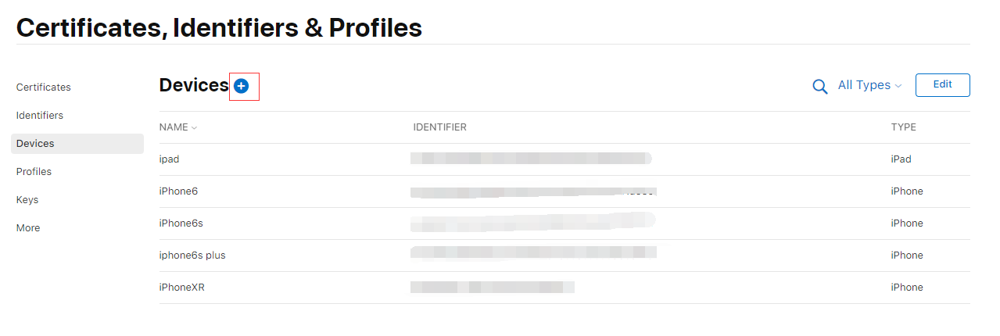
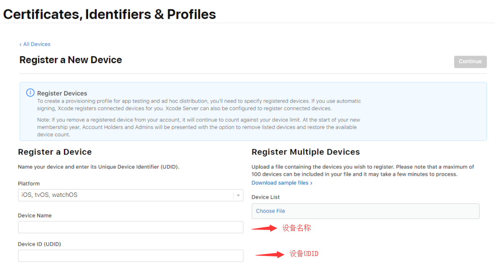
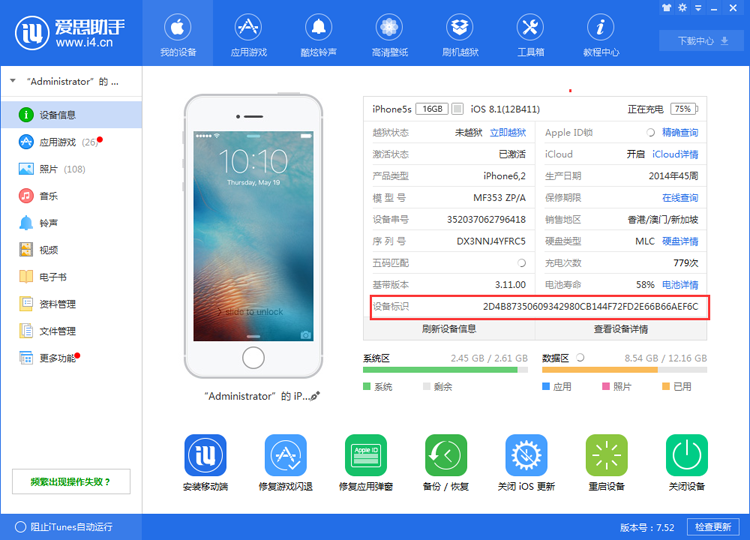
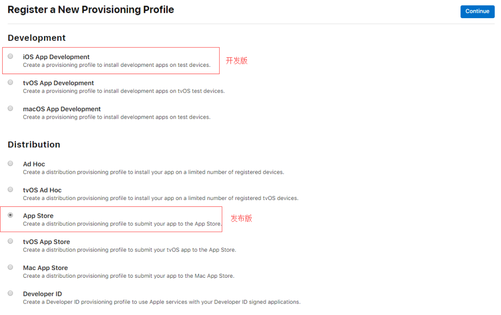
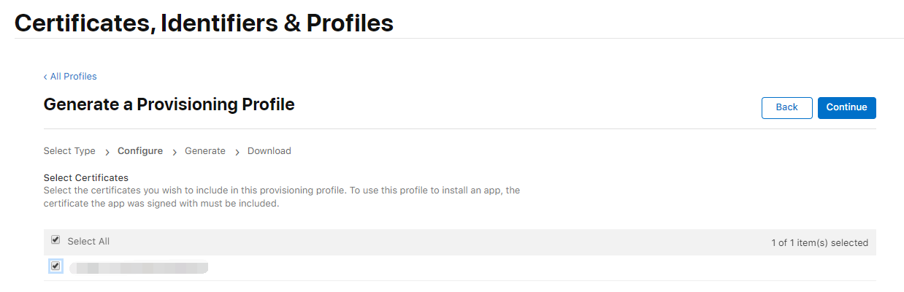
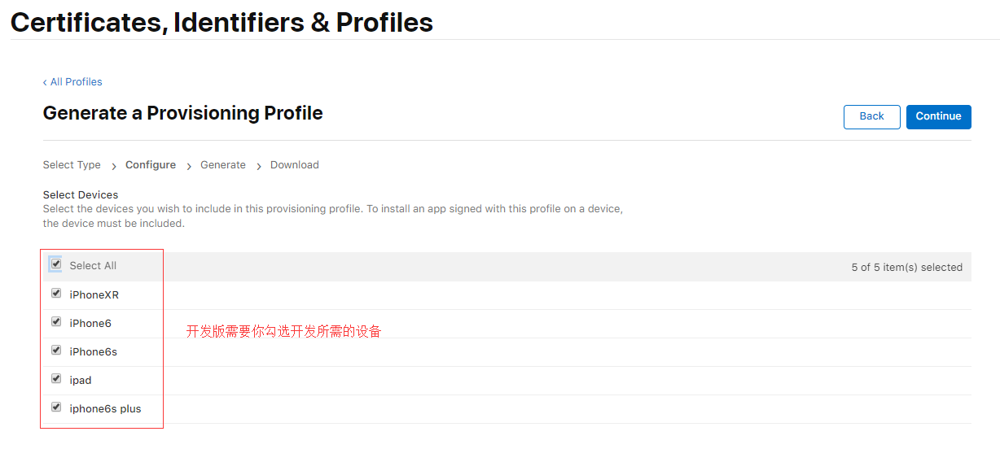
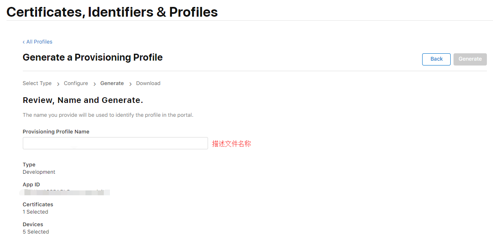
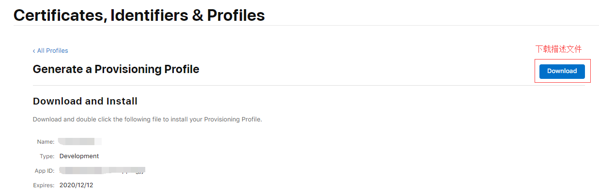

苹果描述文件分为开发版和发布版两种类型，开发版和需要我们添加用户设备才能在真机上进行调试。

### 具体步骤

1. 创建bundle ID

点击Certificates, Identifiers & Profiles，如下图所示：

先来创建Bundle ID（bundle ID可以翻译成包ID,也可以叫APP ID 或应用ID,它是每一个ios应用的`全球唯一标识），点击左侧菜单的Identifiers再点击加号添加按钮进行添加，如下

选中第一个App IDs，再填写描述及bundle ID（按自己的需求来命名，尽量用英文），如下

2. 添加设备（发布版跳过步骤2）

   点击“Devices”进入注册设备界面。点击右上角“+”新建注册设备信息，如下

   

   

   可以通过苹果手机助手获取UDID

   如爱思助手，电脑下载爱思助手，连上苹果手机，设备信息里面那个设备标识就是udid。

   

   3. 点击“Profiles”进入描述文件界面。点击右上角“+”新建描述文件，勾选描述文件类型，如下

      

      

      

      

      

      

