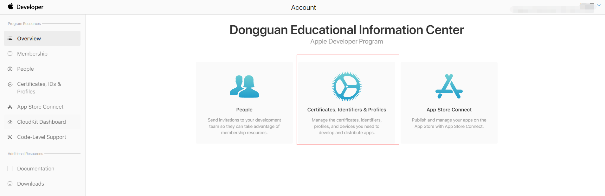
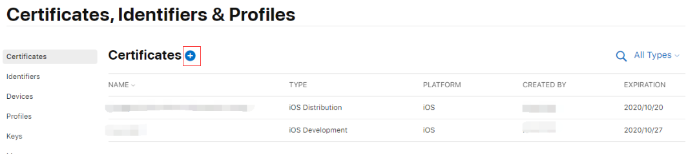
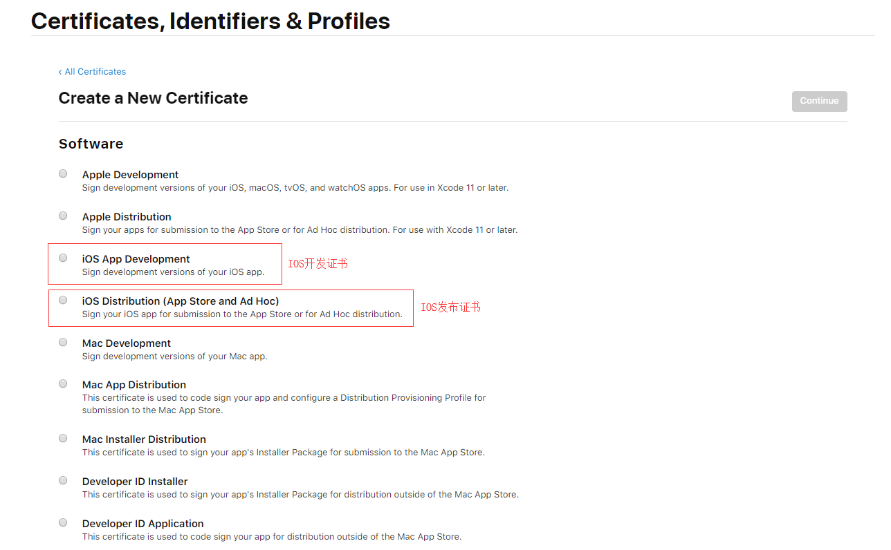
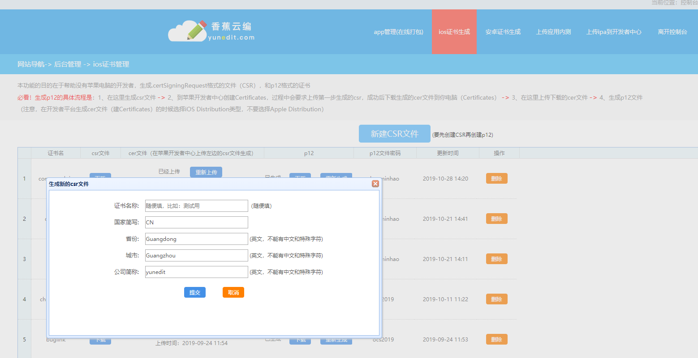
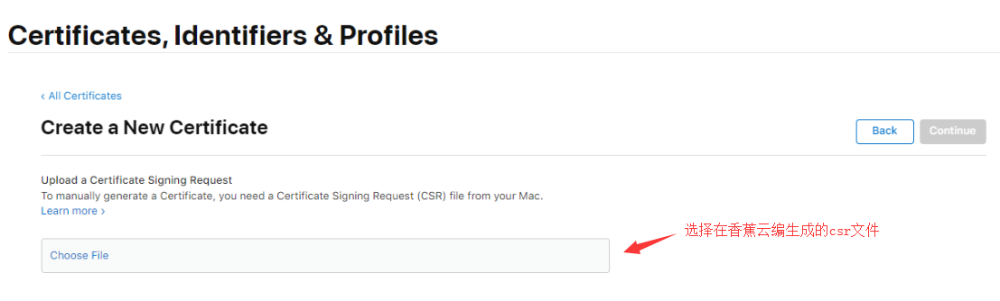
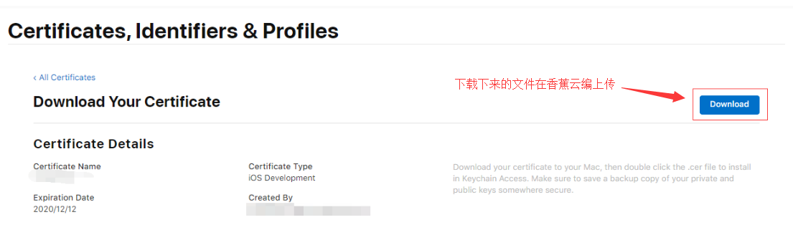
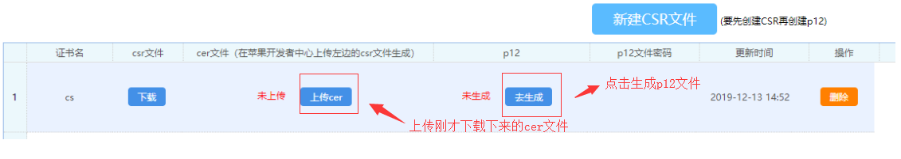
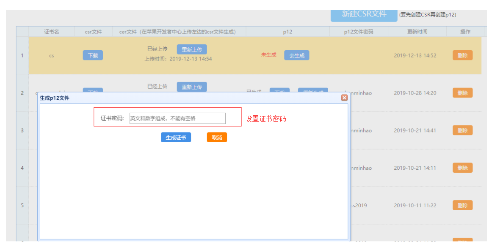

### 具体步骤

1. 登录苹果开发者账号-[传送门](https://idmsa.apple.com/IDMSWebAuth/signin?appIdKey=891bd3417a7776362562d2197f89480a8547b108fd934911bcbea0110d07f757&path=%2Faccount%2F&rv=1)  ，点击“cretificates,IDs&Profiles”进入证书申请界面。点击右上角“+”新建开发证书。勾选证书类型，如下

> 1、iOS开发证书
> iOS开发证书是用于测试APP，在开发过程中安装到苹果手机真机测试APP的运行情况。
> 2、iOS发布证书
> 当APP开发测试好后上线就需要用到iOS发布证书，用iOS发布证书打包的ipa才能上传到App Store审核。

2. window系统下通过第三方网站来生成证书签名请求（CSR）文件，这里我们用到的网站是香蕉云编-[传送门 ](https://www.yunedit.com/update/ioszhengshu/list)。

网站生成p12的具体流程是： 1、在这里生成csr文件 -> 2、到苹果开发者中心创建Certificates，过程中会要求上传第一步生成的csr，成功后下载生成的cer文件到你电脑（Certificates） -> 3、在这里上传下载的cer文件 -> 4、生成p12文件
（注意，在开发者平台生成cer文件（建Certificates）的时候选择iOS Distribution类型，不要选择Apple Distribution）

