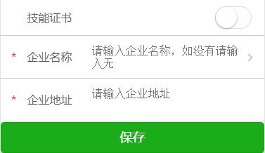
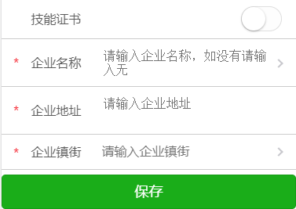

## 移动端开发经验总结（H5和小程序）
### 苹果手机 margin 失效



<center>苹果上的效果图</center>



<center>实际上要实现效果图</center>

我在最后一个 div 设置了 margin-bottom 来解决遮挡问题，当是发现在苹果上面无效，查看其他文章发现是因为：

> 关于 layoutMargins 在 iOS8 后，UIView 有个属性 var layoutMargins: UIEdgeInsets ,用来指定该 View 的 subview 同其 edge 的间距。AutoLayout 使用 margins 来放置内容。 默认的值为 8pt。
> 如果一个 View 是 ViewController 的 rootview，系统会自动设置和管理 margins，top 和 bottom margins 被设置为 0pt，left 和 right 的值根据当前的 size class （文末简单介绍一下 size class）不同而不同，可能取值为 16 或者 20pt(iPhone6 plus, iPad)，你不能修改这些值。

大概的意思就是它把我设置的 margin-bottom 设置为 0，而不是我实际设置的像素

解决方案：我是在下面加了一个 div 设置高度，也可以设置 padding-bottom，根据自身情况选择。

### 苹果手机滑动卡顿

在滑动的页面上加上该样式：

```css
-webkit-overflow-scrolling : touch;
```

但是，-webkit-overflow-scrolling:touch 这个属性也是个超级神坑，比如:

- 在 safari 上，使用了-webkit-overflow-scrolling:touch 之后，页面偶尔会卡住不动。(中招)
- 在 safari 上，点击其他区域，再在滚动区域滑动，滚动条无法滚动的 bug。
- 通过动态添加内容撑开容器，结果根本不能滑动的 bug。(中招)
- 滚动中 scrollTop 属性不会变化
- 手势可穿过其他元素触发元素滚动
- 滚动时暂停其他 transition
  解决方案：

``` html
//方案一
<div id="app" style="-webkit-overflow-scrolling: touch;">
    <div style="min-height:101%"></div>
</div>

//方案二
<div id="app" style="-webkit-overflow-scrolling: touch;">
    <div style="height:calc(100%+1px)"></div>
</div>
```
以上方法不成功还可以使用
```javaScript
//方案三
document.querySelector(".mescroll").addEventListener("scroll",function() {
    const elem = document.querySelector(".mescroll");
    if (this.timerList) {
    clearTimeout(this.timerList);
    }
    let startTopScroll;
    this.timerList = setTimeout(() => {
    startTopScroll = elem.scrollTop;
    // 当滚动条在最底部的时候向上滚动一像素
    if (startTopScroll + elem.offsetHeight >= elem.scrollHeight) {
        // console.log("滚动到底部：", elem);
        elem.scrollTop = elem.scrollHeight - elem.offsetHeight - 1;
    }
    }, 300);
},false);
```
### css连续的纯数字或字母强制换行

```css
white-space: normal;
word-break: break-all;
```
### 解决编辑框移动端不能获取焦点的问题 --- 针对 wangeditor 编辑器

移动端Vue项目，为了解决ios点击延迟的问题，引入了 fastClick，结果导致编辑器不能获得焦点

```javaScript
// 引入FastClick库
import FastClick from 'fastclick'
FastClick.attach(document.body)

// 解决编辑框移动端不能获取焦点的问题
FastClick.prototype.needsClick = function (target) {
  if (target.className.indexOf('w-e') !== -1) {
    return true
  }
  if (target.parentElement) {
   return this.needsClick(target.parentElement)
  }
}
```
## 小程序本地图片转base64

+ wx.chooseImage：得到图片地址
+ wx.getFileSystemManager：创建文件管理类
+ readFileSync：读取本地文件，直接得到base64
```javaScript
wx.chooseImage({
 success: function(res) {
  console.log(wx.getFileSystemManager().readFileSync(res.tempFilePaths[0], "base64"))
 }
})
```
补充说明：小程序图片上传就是设置成原图也是会压缩图片（截至2019/8/28官方还未解决此bug）

## 小程序构建npm提示没找到node_modules目录

```javaScript
//第一步
npm init

//第二步
npm install --production

//第三步
npm i vant-weapp -S --production
```